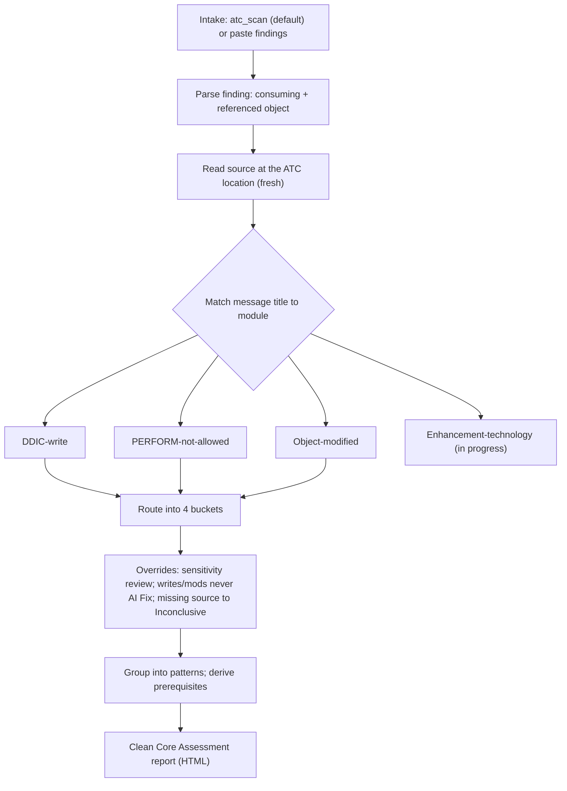

# Skill flow diagrams

High-level flow of the Hexa Clean Core Assessment skill and each finding module — so
you can see what happens *inside* the skill at a glance. For the exact rules, read the
module under [`../references/`](../references).

## Shared assessment workflow

**Buckets:** AI Fix · AI + Developer Fix · Architectural Redesign · Assessment Inconclusive.

## Per-module flows

- [DDIC-write](ddic-write.md) — ✅ active
- [PERFORM-not-allowed](perform-not-allowed.md) — ✅ active
- [Object-modified](object-modified.md) — ✅ active
- [Enhancement-technology](enhancement-technology.md) — 🚧 in progress
