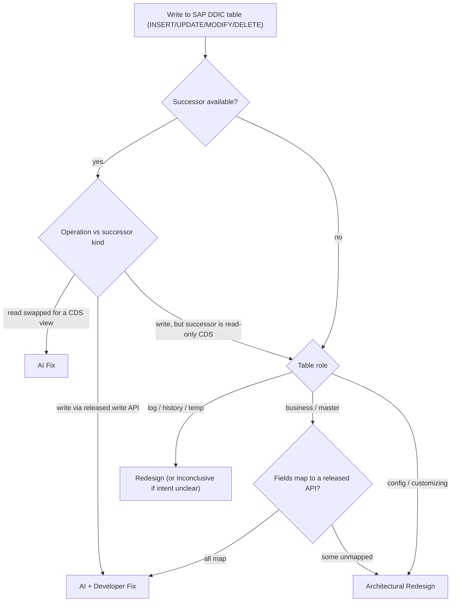

# DDIC-write — flow

Message: *Updating DDIC database tables or DDIC table views is not allowed
(± successor available)*. Rules: [`../references/ddic-write.md`](../references/ddic-write.md).

Guardrail: **writes never reach AI Fix** — the only AI Fix door is a read swapped for a
CDS view. Read-only successors on a write fall through to the no-successor branch.
