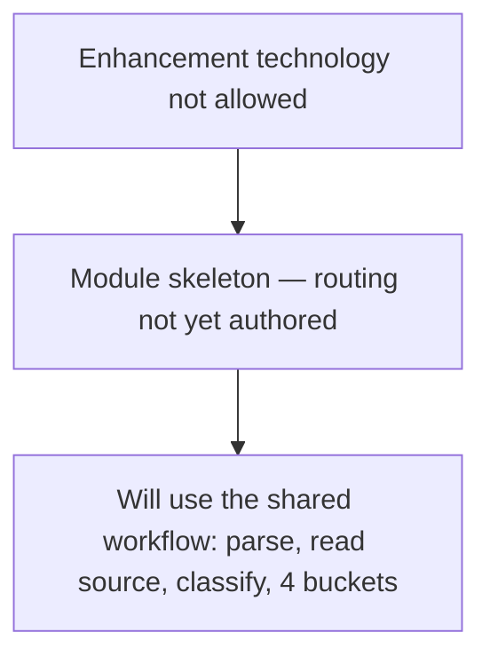

# Enhancement-technology — flow

Message: *Enhancement technology not allowed*. Status: 🚧 **In progress** — the module is
a skeleton; do not rely on it for assessment yet. Rules:
[`../references/enhancement-technology.md`](../references/enhancement-technology.md).

When authored, it will classify the flagged enhancement technology and route into the
four buckets like the active modules.
