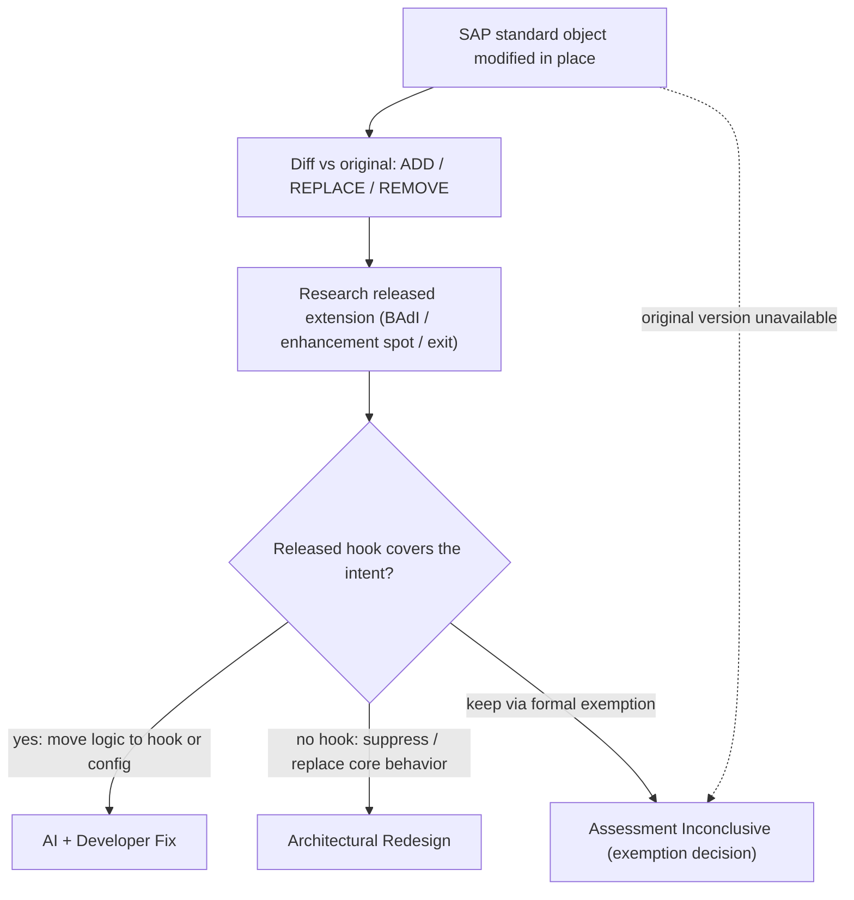

# Object-modified — flow

Message: *Object is modified* (an SAP standard object changed in place). The target is a
released **extension point**, not a write API. Rules:
[`../references/object-modified.md`](../references/object-modified.md).

Guardrail: **modifications never reach AI Fix**. A pure **removal** usually routes to
Redesign/Exception unless a released switch/BAdI disables the same behavior cleanly.
