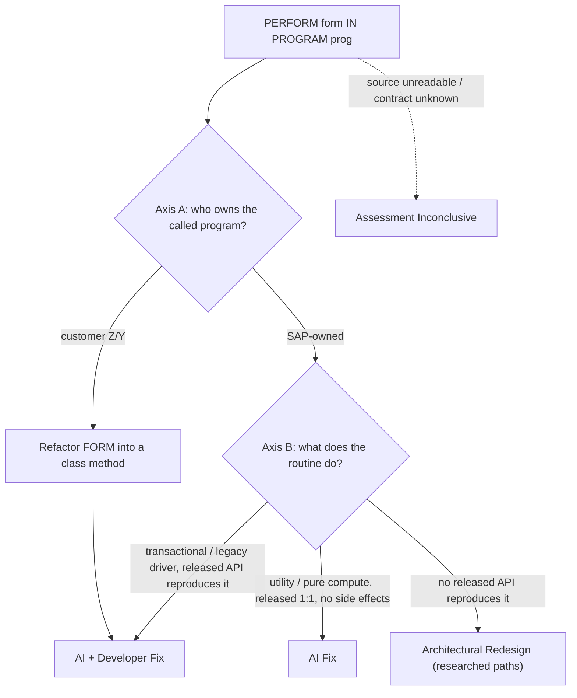

# PERFORM-not-allowed — flow

Message: *PERFORM program is not allowed*. No "successor available" signal — the target
is derived from the source. Rules:
[`../references/perform-not-allowed.md`](../references/perform-not-allowed.md).

Guardrail: **transactional PERFORMs never reach AI Fix** — AI Fix is only for the
SAP-owned, side-effect-free utility swap. The `USING`/`CHANGING`/`TABLES` contract must
be re-plumbed by any replacement.
