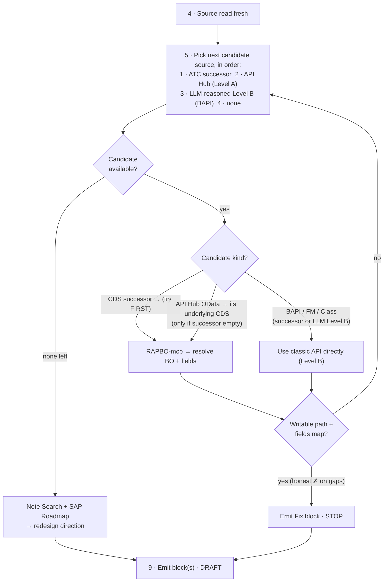

# ATC Remediation (Fix Phase)

> **STATUS: ACTIVE** for the DDIC-write module. Other finding modules are skeletons.

## What this skill is for

This skill is the **fix phase** that runs *after* `atc-assessment`. Assessment
classifies and reports; this skill takes a finding at **clean-core Level D**
(technical debt) and drafts the remediation that lifts it up — proposing the write
API the code should use instead, and producing a **reviewed before→after code
suggestion with an explanation**. It is not a report and never an unattended commit.

The deliverable per remediation pattern is a **before→after snippet + explanation**,
handed to a developer to validate and apply.

## Clean Core Levels — the target

The finding sits at **Level D** and the fix lifts it toward **A** or **B**. Levels
are SAP's extensibility maturity grades (SAP Note **3578329**; objects are graded in
the [Cloudification Repository](https://sap.github.io/abap-atc-cr-cv-s4hc/)).

| Level | Meaning | In this skill |
|-------|---------|---------------|
| **A** | Released public interfaces. **On-stack write = a released RAP BO consumed via EML** (`MODIFY ENTITIES`). Released **OData/A2X** services (`API_*_SRV`) are Level A too, but are consumed **side-by-side** (external) — *not* callable for write from on-stack ABAP. | **Preferred target.** Resolved from the **ATC successor first** (CDS view → on-stack RAP BO via `RAPBO-mcp`); the **API Hub is the fallback** source. Classify the hit as RAP BO (on-stack) vs OData-only (side-by-side), and capture its supported S/4 release(s). |
| **B** | Classic, upgrade-stable API/framework (e.g. BAPI). Safe harbor. | **Fallback target.** Proposed from **LLM reasoning** on the code context — not from a tool. |
| ~~C~~ | Internal SAP object behind a wrapper. Risk-managed. | **Out of scope — never proposed.** |
| **D** | Direct writes to tables, modifications, implicit enhancements. The finding's starting point. | If no Level A/B API exists → **redesign / inconclusive**; consult Notes/Roadmap for a direction. |

## Finding modules (dispatch)

The shared workflow and suggestion format below are shared across all fix modules.
The finding-specific code generation lives in a per-finding module. Match the
finding's message title to its module.

| Check title | Message title | Module | Status |
|-------------|---------------|--------|--------|
| Usage of APIs | Updating DDIC database tables or DDIC table views is not allowed *(± successor available)* | [references/ddic-write.md](references/ddic-write.md) | **Active** |

## Workflow

Follow these steps in order. Steps 5–7 are the level-targeting core: **read the ATC
successor first**, resolve it to a writable target (successor CDS → on-stack RAP BO via
`RAPBO-mcp`; API Hub only as fallback; then LLM-reasoned Level B), and only if nothing
resolves fall back to a direction. **Do not skip Steps 1–3 — never ask the developer for
the object name or finding details up front; derive them from the latest assessment
report and confirm.**

The successor-first resolution (Steps 5–7) at a glance:



1. **Intake from the latest assessment report (default).** Locate the newest
   `hexa-assessment-<YYYY-MM-DD>.html` at the repo root, read it, and extract the
   fixable **DDIC-write** pattern(s) from its Findings detail (object · type · table ·
   operation · fields · locations · derived write API). Do **not** re-assess or re-run
   ATC. Only if no report exists do you fall back to asking for the object/finding (or
   running `atc_scan` per `../atc-assessment/references/atc-run-intake.md`).
2. **Confirm the report with the developer.** Show a one-line summary — report date ·
   object · message · pattern(s) — and ask the developer to **confirm this is the
   assessment to remediate** before doing anything else. Wait for confirmation.
3. **Confirm the target objects via an interactive selection — exactly like the
   assessment scope step.** Do **not** present the member objects as a static markdown
   table and ask for a yes/no; that is the wrong interaction. Instead:
   - **Enumerate the container's members from the ADT virtual filesystem** — list the
     object's folder (e.g. the function group's `…/Function Groups/<FUGR>/` directory)
     to discover every function module / include / TOP include, whether or not a tab is
     open. Do not limit yourself to the active tab.
   - **Present those members as a real selectable list** using the VS Code question /
     multi-select prompt (`vscode_askQuestions` with `multiSelect`), one option per
     member, and let the developer choose which are in scope. Recommend the likely ones
     (the members holding the flagged writes plus their shared declarations), but the
     developer's selection is authoritative — do not decide the scope yourself.
   - **Wait for the selection.** Do **not** generate until the developer has picked; an
     incomplete set silently drops write sites. Read every selected member fresh in
     Step 4.
4. **Re-read the source fresh** at each write location. Objects opened over ADT are
   read-only *virtual* documents, not files on disk — read the open editor tabs /
   attached context, and follow the call chain into includes and called routines
   rather than assuming the write lives in the named object.
5. **Read the ATC successor first — it drives the routing.** The DDIC-write finding
   already carries SAP's successor verdict; read it *before* any MCP call or API Hub
   lookup and classify its kind: **CDS view(s)** · **classic API (BAPI / FM / Class)** ·
   **none**. This decides which candidate source you try first. No MCP call yet.
6. **Resolve a writable target in strict priority order — first usable target wins,
   then stop.** Walk the sources below in order; the moment one yields `fixApproach.level`
   `A`/`A_partial` (a writable, local-contract BO with the field(s) mapped), stop and go
   to Step 8, **consuming the MCP's `fixApproach` directly** (`level` · `writeTarget` ·
   `mappedFields` · `unmappedFields`) — do not re-derive the route. **Be honest about
   unmapped fields** — the MCP lists them in `unmappedFields`; carry them as
   `✗ (→ residual redesign)`, never hide or fake a mapping.
   1. **Successor = CDS view(s)** → a CDS view is read-only, so treat it as a **hint** to
      the writable RAP BO behind it. Pass each CDS successor with the written **`table` +
      `fields[]`** to **`RAPBO-mcp` `find_rap_bo`**, one at a time — in one call it returns
      the on-stack RAP BO, **each** field's exposed BO element, the **release contract**,
      and a ready **`fixApproach`** (`level` · `writeTarget` = `MODIFY ENTITIES <entity>` ·
      `mappedFields` · `unmappedFields`). **Level A only when `fixApproach.level` is `A`
      or `A_partial`** — a concrete (non-abstract) writable BO released under
      **`#PUBLIC_LOCAL_API`** with the field(s) mapped. A **`#PUBLIC_REMOTE_API`** or
      **abstract** BO is *not* an on-stack EML target → the MCP returns `level B`. First
      CDS that yields `level A` wins. If a basic view returns no BO, that's an honest miss
      — continue to the API Hub, don't stop. **Do not touch the API Hub while a CDS
      successor is still untried.**
   2. **Successor = BAPI / Function Module / Class** → no BO derivation; use the given API
      directly, reason the field mapping → **Level B**.
   3. **Successor exhausted / none / unclear → API Hub (fallback).** Ask the **API Hub
      MCP** for the released write target; it resolves the OData / released API
      (`API_*_SRV`) to its **underlying CDS view** itself, and you pass **that CDS view**
      with the written **`table` + `fields[]`** to **`RAPBO-mcp` `find_rap_bo`** → its
      `fixApproach` gives the route. The same **`#PUBLIC_LOCAL_API`** gate applies: an
      API-Hub OData projection is typically **`#PUBLIC_REMOTE_API`** → `level B` on-stack.
      Capture the **supported S/4 release(s)** from `ReleaseInfo`. **Never emit an ABAP
      OData call as the fix** — an OData/A2X service is side-by-side only.
   4. **No writable RAP BO anywhere → LLM-reasoned Level B classic API.** Reason a
      plausible classic, upgrade-stable API (e.g. `BAPI_*_CHANGE` / `_CREATE`) from the
      code context → **Level B**. No MCP.
7. **No Level A or B target → direction, not code.** If nothing above resolves, take the
   **No-API branch** below: consult **Note Search** and **Roadmap** and emit the
   **redesign-direction block** — never fabricate a fix.
8. **Generate the fix** — replace the flagged `INSERT`/`UPDATE`/`MODIFY`/`DELETE`
   with the target API call, mapping each written field, and scaffold the LUW / lock
   / return-code handling. See the matched module.
9. **Emit the suggestion in the dedicated format below** — one block per pattern.
   Follow that template exactly; do not invent an ad-hoc layout.

**No-API branch (redesign / inconclusive).** If neither a Level A nor a Level B API
exists, do **not** fabricate a fix. Consult **Note Search** and **Roadmap** for the
strategic/successor direction, and emit the **redesign-direction block** of the
dedicated format (owning process/behavior, data-model change, or what to investigate)
with the decision and owner — no drop-in code.

## Level-targeting priority

| Order | Source | Result |
|-------|--------|--------|
| 1 | **ATC successor = CDS view** → `RAPBO-mcp` `find_rap_bo` (table + fields[]), one CDS at a time | writable BO + **`#PUBLIC_LOCAL_API`** + field(s) mapped → **Level A** (EML); remote/abstract → **Level B** |
| 2 | **ATC successor = BAPI / FM / Class** | use directly, map fields → **Level B** |
| 3 | **API Hub MCP** (only after the successor yields nothing) resolves OData → its underlying CDS; pass that CDS to `RAPBO-mcp` `find_rap_bo` | local-contract BO + field mapping → **Level A**; remote-only → **Level B** |
| 4 | **LLM reasoning** on code context | plausible classic API (BAPI) → **Level B** |
| — | none of the above | **no API → redesign / inconclusive** (Notes/Roadmap for direction) |

Level C is never proposed. Prefer A over B; when both are plausible, lead with the
Level A released API and note the classic API only as the developer's fallback.

## MCP usage (one job each)

- **`RAPBO-mcp` `find_rap_bo` → Step 6** — the Level A resolver, one job: **CDS view +
  written `table` + `fields[]` → writable RAP BO + each field's exposed BO element +
  release contract + a ready `fixApproach`**, in one call. Input is always a CDS view
  (the ATC successor, or the API Hub's underlying CDS). `fixApproach` carries the route:
  `level` (`A`/`A_partial`/`B`), `writeTarget` (`MODIFY ENTITIES <entity>` + release
  contract), `mappedFields` (`db → boElement`), and `unmappedFields`. **Level A is gated
  on a `#PUBLIC_LOCAL_API` contract** — a `#PUBLIC_REMOTE_API` or **abstract** BO is *not*
  on-stack and the MCP returns `level B`. Read-only; if there's no BO it says so honestly.
  (`odata_to_cds` is an on-stack fallback only — OData→CDS normally lives in the API Hub
  MCP.)
- **API Hub MCP → Step 6, fallback only** — reached only after the ATC successor yields
  no writable RAP BO; it resolves the released OData/API to its **underlying CDS view**,
  which you then pass to `RAPBO-mcp`. Never emitted as an on-stack write call.
- **Level B → no MCP** — proposed purely from LLM reasoning on the code context.
- **Note Search + Roadmap → no-API branch only** — used to emit a redesign/
  inconclusive direction, never to grade an API.

## Dedicated suggestion format

The output has a **fixed high-level skeleton** that stays identical on every run; it only
**expands** by the remediation data (how many patterns, Fix vs Redesign block, inline vs
OO After). The skeleton is:

```
<run header>
<Fix 1 block>
<Fix 2 block>
… <Fix N block> …
```

Concretely, every run is:

1. A **one-line run header** —
   `**Remediation — <object>(s) · <report date>** · <F> finding(s) → <P> pattern(s)`.
2. Then **one block per remediation pattern**, numbered `Fix 1 … Fix N`. **N = the number
   of patterns** in the assessment — expand dynamically. Never collapse several patterns
   into one block, and never emit only the first; every pattern gets its own block, in
   report order.

Use the **fix block** when a Level A/B API exists and the **redesign block** when it does
not; a single run may interleave both, still numbered in sequence. Within each block use
exactly the template and section order below — do not add, drop, rename, or reorder
sections, and do not invent an alternate layout.

### Fix block (Level A or B)

```md
### Fix <n> — <OBJECT> · <TABLE> · <OPERATION> <FIELD(S)>

| Fix profile | |
|---|---|
| Object | <object> (<type>) |
| Table | <table> |
| Operation | <operation> · <field(s)> |
| Locations | `×N` — <location list> |
| Level transition | `D → A (<released api>)` · fallback `D → B (<classic api>)`  —  or just `D → B (<classic api>)` when no Level A exists |
| API kind | Level A: RAP BO (EML, on-stack) · Level B: classic (BAPI/FM)  —  list only the level(s) that apply |
| Field resolution | <db field → CDS element trail + exposed name on the released BO, from the RAP-BO resolver> \| n/a (no successor / BO) |
| Supported release(s) | Level A: <verify on-stack EML release / read-only control> · Level B: <ReleaseInfo, e.g. `2023 FPS00` — or "verify in your system"> |
| Owning process | <SAP business process / business object> |

**Before**
​```abap
<flagged statement(s)>
​```

**After** — drafted; developer validates, not auto-applied
**Encapsulation** · <reusable `×N` pattern → local class method (Clean ABAP)>  |  <one-off write → inline>

*Option A — Level A (<released BO> via EML):*
​```abap
<EML MODIFY ENTITIES write with LUW / REPORTED-FAILED handling>
​```

*Option B — Level B (<classic api>, fallback):*
​```abap
<classic API write with LUW / return-code handling>
​```
> Show **Option A then Option B** whenever both levels exist (A always leads, B is the fallback).
> When only one level exists, emit **only that Option** and drop the `Option A/B` labels. For a
> genuine one-off write, drop the class and inline the call.

**Field mapping**
| Written field | Level A target | Level B target | Mapped? |
|---|---|---|---|
| <field> | <BO element, or —> | <API field, or —> | ✓ / ✗ (→ residual redesign) |

**Verify before shipping**
- Level A gate: <field not read-only on the BO projection · BO released for on-stack EML on the target release>
- Level B gate: <classic API is the intended upgrade-stable path · accepts the written values>

**Sensitivity** · none  |  ⚠ <security/user/financial> — mandatory review regardless of level
```

### Redesign block (no API)

```md
### Fix <n> — <OBJECT> · <TABLE> · <OPERATION> <FIELD(S)> — no like-for-like API

| Fix profile | |
|---|---|
| Object | <object> (<type>) |
| Table | <table> |
| Operation | <operation> · <field(s)> |
| Locations | `×N` — <location list> |
| Level transition | `D → redesign / inconclusive` |
| Owning process | <SAP business process / behavior that should own the write> |

**Why no code fix** · <config/customizing, log/history, or unmappable field(s)>
**Proposed direction** · <owning behavior · customizing move · data-model change · what to investigate>
**Evidence** · <relevant SAP Note(s) from Note Search · Roadmap successor/direction, if any>
**Decision & owner** · <decision to make> — <owner>
```

Rules:
- **Consistent envelope, dynamic count.** Always emit the run header, then exactly one
  numbered block per pattern (`Fix 1 … Fix N`). The format never changes between runs;
  only the number of blocks does. If the report has 1 pattern, emit 1 block; if it has 7,
  emit 7.
- **Reusable pattern → OO fix.** When the same write is remediated at more than one site
  (`×N`, or across several includes/routines), the **After** shows an OO ABAP class method
  (Clean ABAP) plus the call at each site — never a `FORM` subroutine or copy-pasted inline
  calls. State the choice in the **Encapsulation** line. A true one-off write stays inline.
  See `references/ddic-write.md` §4.
- One block per pattern; a single finding that splits (most fields mappable, one not)
  uses a **Fix block** with the unmapped field marked `✗ (→ residual redesign)` and a
  short residual note — do not silently drop it.
- Every `✗` field mapping and every read-only-successor caveat must be surfaced, not
  hidden.
- Never write the remediated code into the object or activate anything — the block is a
  proposal for the developer to apply.
- **Self-check before returning.** Confirm the output matches the fixed skeleton: a run
  header, then `Fix 1 … Fix N` where **N = pattern count**; each **Fix block** has exactly
  these sections in order — `### Fix n` heading · Fix profile table · Before · After
  (with Encapsulation line, then `Option A`/`Option B` code in that order) · Field mapping
  · Verify before shipping · Sensitivity. The **Fix profile** rows are fixed and in this
  order: Object · Table · Operation · Locations · Level transition · API kind · Field
  resolution · Supported release(s) · Owning process. The **Field mapping** table always
  has the four columns `Written field | Level A target | Level B target | Mapped?` (use `—`
  for an absent level). **Verify before shipping** always lists the Level A gate and the
  Level B gate (drop the line for a level that does not apply). Each **Redesign block** —
  `### Fix n` heading · Fix profile table · Why no code fix · Proposed direction · Evidence
  · Decision & owner. Do not add rows/sections, ask trailing questions, or reorder. If
  anything is missing, out of order, renamed, or added, reformat before sending.

## Boundaries

- **Drafts and explains only** — never auto-applies a DDIC write; the developer
  validates transactional semantics and tests before it ships.
- **No read-swap** — a DDIC-write finding is a write; there is no unattended fix path.
- **Level A or B only** — never proposes Level C. No API → redesign/inconclusive.
- **Never flatly refuses** — the no-API case still gets a proposed direction (via
  Notes/Roadmap), not a bare rejection.
- **DDIC-write only for now** — other messages wait for their own modules.
- **Never suppress or exempt** — real remediation or a formal ATC exemption only.
